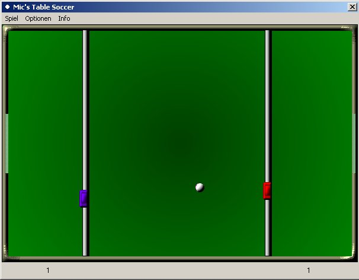



## A Mini Table Soccer Game

### Description

This is a little Table Soccer game i wrote on a day. The code is VERY simple, so it may be right for beginners to start a game with moving and changing sprites. I am a programming beginner from germany and hope you like it.
 
### More Info
 

             |
---                |---
**Submitted On**   |2002-12-18 14:32:56
**By**             |[Michael Boese](https://github.com/Planet-Source-Code/PSCIndex/blob/master/ByAuthor/michael-boese.md)
**Level**          |Beginner
**User Rating**    |4.7 (14 globes from 3 users)
**Compatibility**  |VB 4\.0 \(32\-bit\), VB 5\.0, VB 6\.0
**Category**       |[Games](https://github.com/Planet-Source-Code/PSCIndex/blob/master/ByCategory/games__1-38.md)
**World**          |[Visual Basic](https://github.com/Planet-Source-Code/PSCIndex/blob/master/ByWorld/visual-basic.md)
**Archive File**   |[A\_Mini\_Tab15161212202002\.zip](https://github.com/Planet-Source-Code/michael-boese-a-mini-table-soccer-game__1-41739/archive/master.zip)

